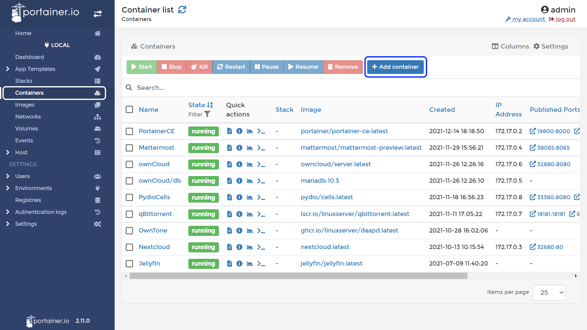
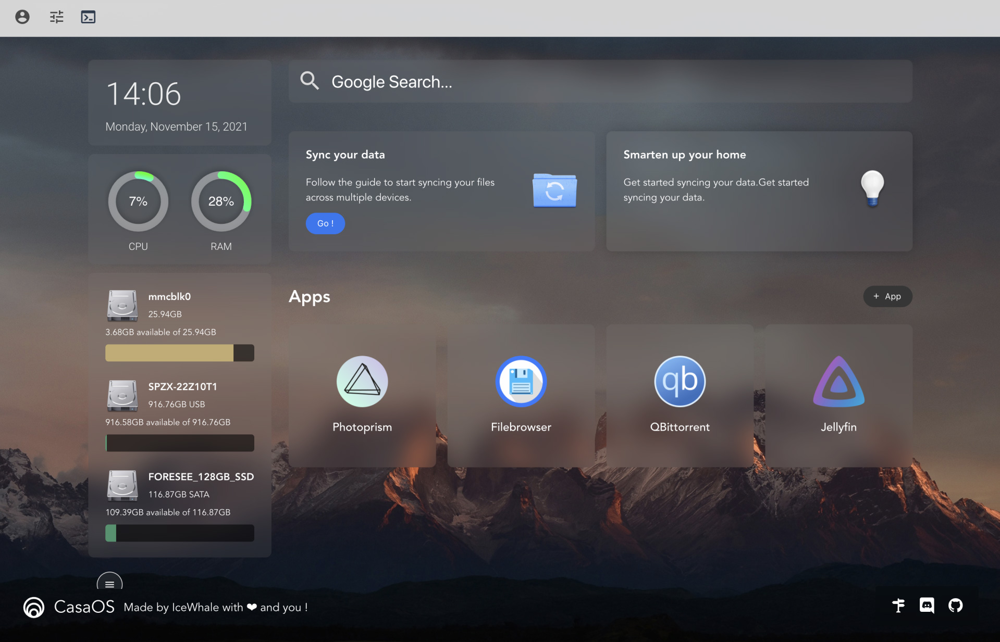

<!--
 * @Author: itgoyo itgoyo@foxmail.com
 * @Date: 2022-12-08 16:51:41
 * @LastEditors: itgoyo itgoyo@foxmail.com
 * @LastEditTime: 2022-12-08 17:41:16
 * @FilePath: /undefined/Users/itgoyo/Documents/同步空间/SyncBaidu/Article/awesome-docker/README.md
 * @Description: 这是默认设置,请设置`customMade`, 打开koroFileHeader查看配置 进行设置: https://github.com/OBKoro1/koro1FileHeader/wiki/%E9%85%8D%E7%BD%AE
-->
# 整理全网有趣好玩的Docker

## 面板类

- Portainer - <https://github.com/portainer/portainer>

是一款开源的 Docker 管理工具，它可以让用户通过 Web 界面管理 Docker 环境。它提供了一个友好的用户界面，可以让用户轻松管理容器、镜像和网络。Portainer 还支持多种操作系统，包括 Windows、macOS 和 Linux。它可以让用户快速部署和管理 Docker 环境，提高工作效率。

- CasaOS - <https://github.com/IceWhaleTech/CasaOS>

Zimaboard家出品的一个Docker管理面板，UI还有功能比较好看实用，颜值党可以优先考虑

## 脚本类

- qinglong - <https://github.com/whyour/qinglong>

自动完成JD各种任务，然后自动获取京豆。

- qiandao - <https://github.com/qiandao-today/qiandao>

一键帮你签到各大网站，再也不用每天都手动登录网页或者是App点击签到了。

## 下载类

- qBittorrent - <https://github.com/qbittorrent/qBittorrent>

是一款开源的 BitTorrent 客户端，它允许用户通过 BitTorrent 协议进行文件下载和共享。它与 Transmission 类似，提供了一个简单易用的界面，可以让用户轻松管理多个下载任务。qBittorrent 的特色之一是它支持多种语言，并且拥有丰富的插件，可以让用户根据自己的需要定制软件功能。它支持多种操作系统，包括 Windows、macOS 和 Linux。

- Transmission - <https://github.com/transmission/transmission>

是一款开源的 BitTorrent 客户端，它允许用户通过 BitTorrent 协议进行文件下载和共享。它提供了一个简单易用的界面，可以让用户轻松管理多个下载任务。Transmission 支持多种操作系统，包括 Windows、macOS 和 Linux。

## 影音类

- EMBY - <https://github.com/MediaBrowser/Emby>

是一款媒体服务器软件，可以将电脑上的音乐、视频和图片文件转换为流媒体，供家庭网络内的设备播放。它支持多种媒体格式，可以让用户在不同的设备上观看自己喜欢的内容。EMBY 还提供了丰富的浏览和管理功能，可以让用户轻松找到想要观看的内容。它支持多种操作系统，包括 Windows、macOS 和 Linux。

- Jellyfin - <https://github.com/jellyfin/jellyfin>

是一款开源的媒体服务器软件，可以将电脑上的音乐、视频和图片文件转换为流媒体，供家庭网络内的设备播放。它与 EMBY 类似，支持多种媒体格式，并提供丰富的浏览和管理功能。不同的是，Jellyfin 是完全开源的，用户可以根据自己的需要定制软件功能。它支持多种操作系统，包括 Windows、macOS 和 Linux。

## 自动化类

- bililive-go （自动录制）- <https://github.com/hr3lxphr6j/bililive-go>

## 实用工具类

- SpeedTest （测速）- <https://github.com/librespeed/speedtest>
- Syncthing （同步）- <https://github.com/syncthing/syncthing>
- Heimdall (导航) - <https://github.com/linuxserver/Heimdall>

## 电子书

- BookBrowser - <https://github.com/pgaskin/BookBrowser>
- Calibre-Web - <https://github.com/janeczku/calibre-web>
- TaleBook - <https://github.com/talebook/talebook>
